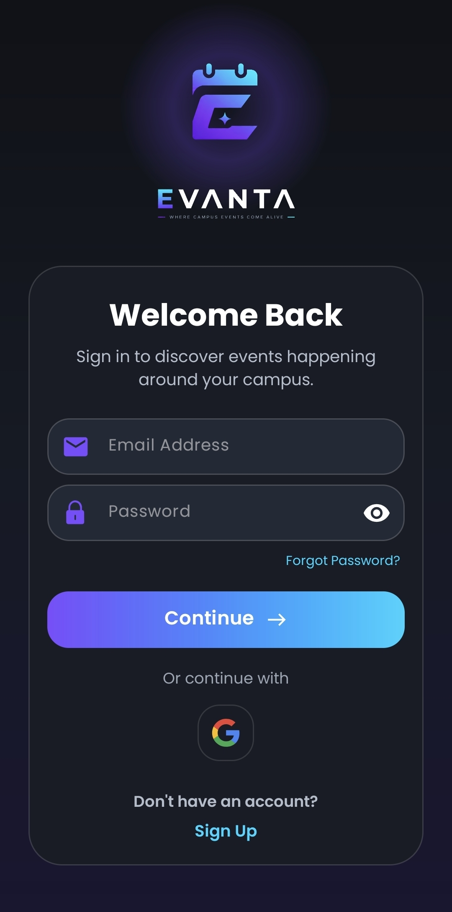
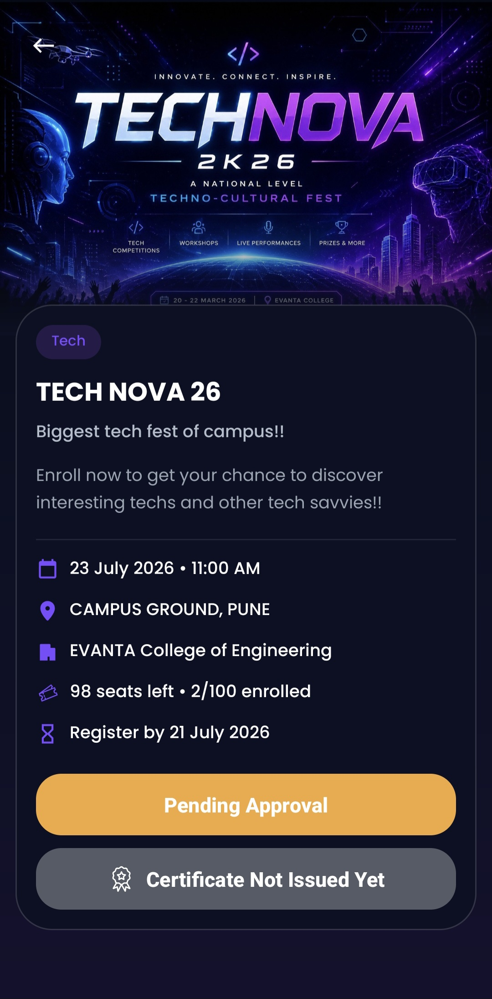
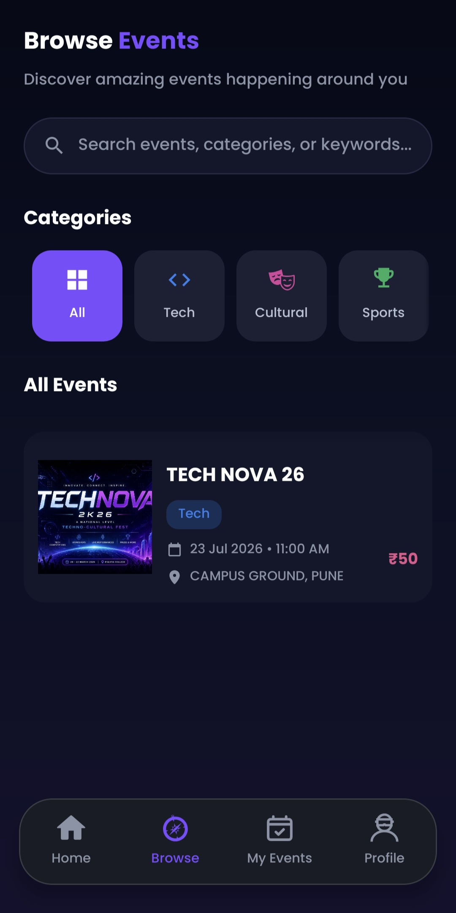
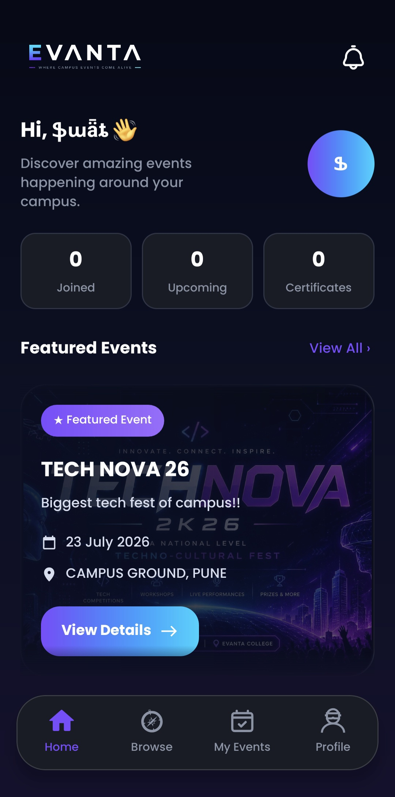

# EVANTA

A college event-management Android app. Students discover and register for
campus events; college admins post events, approve registrations, send push
notifications, and issue certificates.

Built with **Java + Firebase Auth + Supabase (Postgres/PostgREST) + FCM push**.

## Screenshots

| Login | Student dashboard | Event detail | Admin manager |
|:---:|:---:|:---:|:---:|
|  |  |  |  |

---

## Screenshots

| Login | Student dashboard | Event detail | Admin manager |
|:---:|:---:|:---:|:---:|
|  |  |  |  |

---

## Features

- **Students** — browse events, register, track approval status, reapply after a
  rejection, receive certificates, and get push notifications.
- **Admins** — create/edit events, approve or reject registrations, issue
  certificates, and get notified when students register. Each admin owns the
  events they create (enforced in the database via RLS).
- **Auth** — email/password and Google Sign-In (Firebase Auth).
- **Push** — Firebase Cloud Messaging via FCM HTTP v1, triggered from Supabase.

## Tech stack

| Layer | Tech |
|-------|------|
| App | Android (Java), Retrofit + OkHttp, Glide, Material Components |
| Auth | Firebase Authentication |
| Backend | Supabase — Postgres, PostgREST, Row-Level Security, Edge Functions (Deno) |
| Push | Firebase Cloud Messaging (HTTP v1) |

## Project layout

```
app/src/main/java/com/evanta/app/   Activities, fragments, adapters, models
app/src/main/res/                   Layouts, drawables, themes
app/src/main/keepRules/             R8 keep rules for the release build
```

The backend lives in a Supabase project (Postgres + PostgREST + an Edge Function
for FCM push) and Firebase (Auth + Cloud Messaging). It is configured in the
cloud, not checked into this repo.

## Building

1. Clone the repo and open it in Android Studio.
2. You'll need your own `app/google-services.json` from a Firebase project and a
   Supabase project of your own; point `RetrofitClient` at your Supabase URL and
   anon key.
3. To build a **release** you need a signing keystore. Create a
   `keystore.properties` file at the project root with `storeFile`,
   `storePassword`, `keyAlias`, and `keyPassword`. Both `keystore.properties` and
   the `.jks` keystore are gitignored and never committed.
4. Debug build: just Run ▶ in Android Studio. Release build:
   `./gradlew bundleRelease` (or `assembleRelease` for an APK).

## Security notes

- The Supabase **anon key** in `RetrofitClient` is public **by design** — it only
  grants what Row-Level Security allows, and RLS is enabled on every table.
- The FCM service-account key, the Supabase service-role key, and the signing
  keystore are **never** committed (all gitignored). The Edge Function reads the
  service account from a Supabase secret at runtime.

## License / usage

**© 2026 Swaraj Tarte. All rights reserved.**

This repository is public so the project can be **viewed** — for example as part
of a portfolio. It is **not** open source. No permission is granted to copy,
reuse, modify, redistribute, or publish this code or any part of it, in any
form, without the author's prior written consent.

Viewing the source is welcome. Using it is not.
